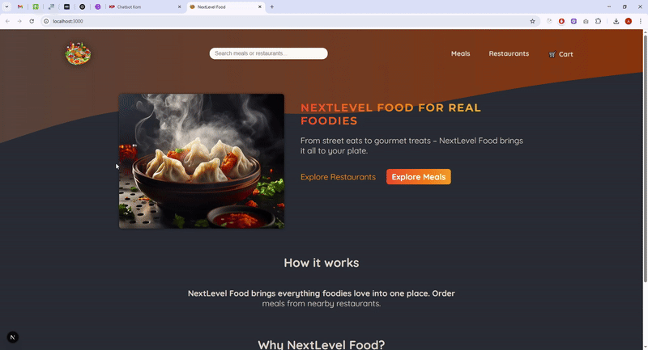

# NextLevel Food  - Next.js + MySQL Food Delivery App

This is a [Next.js](https://nextjs.org) project bootstrapped with [`create-next-app`](https://nextjs.org/docs/app/api-reference/cli/create-next-app). The backend uses **MySQL** as the database, integrated via [Sequelize](https://sequelize.org/) and mysql2.

## 📺 Project Demo

  
  
   [Watch Preview](https://raw.githubusercontent.com/sumedha-softech/food-delivery-nextjs/main/doc/nextLevel-food.mp4)

## Features

- Modern Next.js 15 app directory structure
- MySql database integration for meals, restaurants, and orders
- Stripe payment gateway integration for secure online payments
- Real-time delivery estimates using OpenRouteService API
- Image upload and management
- Interactive UI with React 19
- Location features with Leaflet maps

## Getting Started

### 1. Install dependencies

```bash
npm install
# or
yarn install
```

### 2. Configure Environment Variables

Copy `.env.example` to `.env` and fill in your SQL Server connection details:

```
DB_NAME = <DATABASE_NAME>
DB_HOST = <DATABASE_HOST>
DB_USERNAME = <DATABASE_USERNAME>
DB_PASSWORD = <DATABASE_PASSWORD>
STRIPE_SECRET_KEY = <sk_test_xxxxxxxxxxxxxxxx>
NEXT_PUBLIC_STRIPE_PUBLISHABLE_KEY = <pk_test_xxxxxxxxxxxxxxxx>
NEXT_PUBLIC_BASE_URL = <YOUR_DEVELOPMENT_BASE_URL>
NEXT_PUBLIC_OPENROUTESERVICE_API_KEY = <YOUR_API_KEY_HERE>
```

- **STRIPE_SECRET_KEY**: Required for processing payments via Stripe.
- **NEXT_PUBLIC_STRIPE_PUBLISHABLE_KEY**: Public Stripe key for frontend.
- **NEXT_PUBLIC_BASE_URL**: Base URL of your frontend application (e.g., http://localhost:3000), used for redirects from Stripe payment gateway.
- **NEXT_PUBLIC_OPENROUTESERVICE_API_KEY**: API key to fetch delivery time/distance estimates.

### 3. Run the development server

```bash
npm run dev
```

Open [http://localhost:3000](http://localhost:3000) in your browser.

## Database Setup

Connect to your MySQL instance and run the following SQL to create the database and tables:

```sql
-- Create the database
CREATE DATABASE sql12791241;
```

- The app uses Sequelize for ORM. Models are located in the [`models/`](models/) directory.
- On first run, Sequelize will attempt to connect and sync models to your database.

## Project Structure

- [`app/`](app/): Next.js app directory (pages, layouts, API routes)
- [`models/`](models/): Sequelize models for SQL Server
- [`lib/`](lib/): Server actions and utilities
- [`_components/`](./_components/): React components
- [`config/database.js`](config/database.js): Sequelize SQL Server connection

## Payment Integration

This app uses **Stripe** for processing payments securely:
- Customers can pay for their orders online.
- Payments are processed using the backend Stripe secret key.
- Payment status is tracked for each order
For configuration, ensure Stripe API keys are added to **.env**

## Delivery Time Estimation

To provide real-time delivery estimates, the app integrates with [https://openrouteservice.org/](OpenRouteService API):
- Calculates delivery distances and estimated arrival times based on restaurant and customer locations.
- Uses the API key specified as NEXT_PUBLIC_OPENROUTESERVICE_API_KEY.

## Deployment

You can deploy this app to any platform that supports Node.js and SQL Server. For more, see [Next.js deployment docs](https://nextjs.org/docs/app/building-your-application/deploying).

## License

MIT License.

---

**Note:** For database schema and migrations, see the [`models/`](models/) directory and update as needed for your